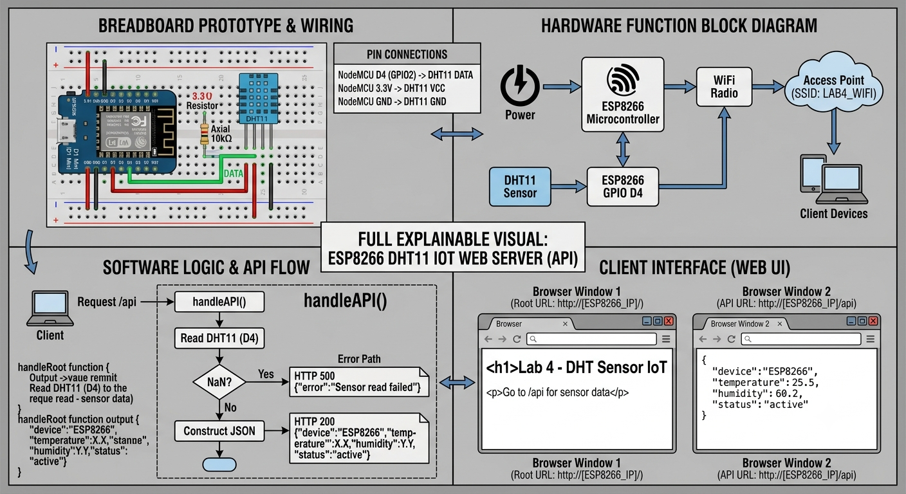

# ESP8266 IoT Telemetry & Monitoring Platform


## Overview

This project is a multi-lab IoT telemetry and monitoring platform built using the ESP8266 NodeMCU V3, Python Flask, and web-based dashboards.
<p align="center">
  
</p>
The goal of this project was to learn and apply concepts across:

- Embedded Systems
- IoT Development
- Networking
- API Development
- Telemetry Collection
- Data Logging
- Dashboard Development
- Python Backend Services
- System Monitoring

The project progresses from a basic web server to a complete telemetry and analytics platform capable of collecting, transmitting, storing, and visualizing data.

---

## 📟 Hardware Used

- ESP8266 NodeMCU V3
- DHT11 Temperature/Humidity Sensor
- Breadboard
- Jumper Wires
- USB Cable
- ANY Workstation

---

## 💻 Software Used

- Arduino IDE
- Python 3
- Flask
- HTML
- CSS
- JSON

---

## 🏗️ Project Architecture

```text
ESP8266 + DHT11
        │
        ▼
WiFi Network
        │
        ▼
Flask API Server
        │
        ▼
Telemetry Storage
(JSON)
        │
        ▼
Dashboard & Analytics
```

---

## 🔌 Embedded Layer
* ESP8266 firmware
* sensor integration
* multi-device support
## 🌐 Network Layer
* HTTP communication
* JSON APIs
* WiFi AP + STA modes
## 🖥 Backend Layer
* Flask server
* telemetry ingestion
* audit logging
* data storage
## 📊 Analytics Layer
* dashboard UI
* history tracking
* device inventory
* CSV export

# 📦 REQUIRED LIBRARIES

Install in Arduino IDE:

* DHT sensor library (Adafruit)
* Adafruit Unified Sensor

---

* If you don’t see them: USE BELOW

# 👉 Library Manager → search:

* DHT sensor library
* Adafruit Unified Sensor

---

# MAKE SURE TO upload  the url for the ESP8266 LIBRARY IN ARDUINO IDE:

* Go To File -> Preferences -> Additonal boards manager URLs -> Paste this link inside it for ESP8266 Library Below :
* http://arduino.esp8266.com/stable/package_esp8266com_index.json


